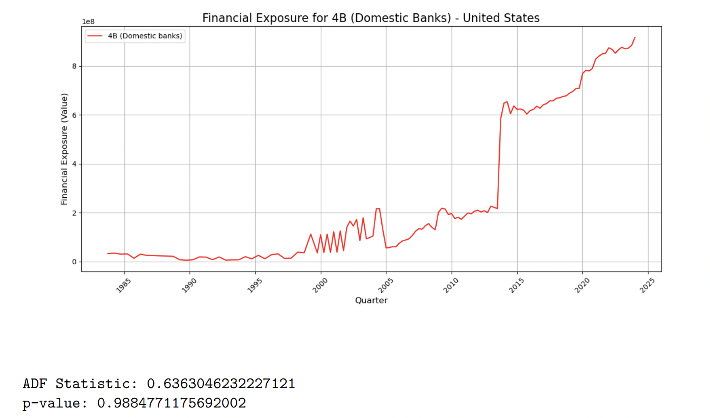
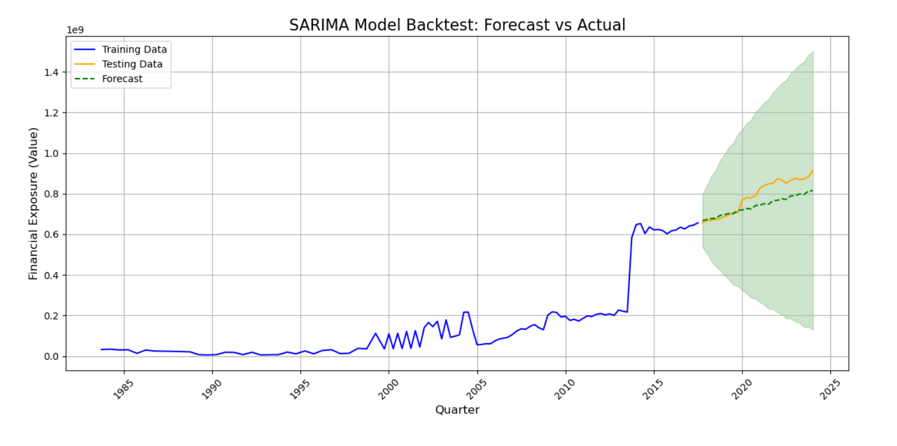
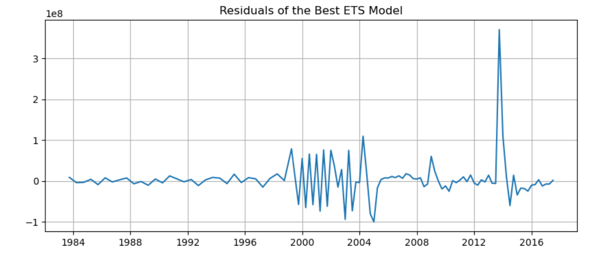

# GlobalRiskAnalysisUSA
# Financial Exposure Forecasting Using Time Series Models

This project utilizes various time series models, including the **Prophet** model, to forecast financial exposure trends for the United States based on historical data. The project explores traditional time series approaches such as Exponential Smoothing and ARIMA, as well as machine learning methods like Long Short-Term Memory (LSTM) networks.

## Table of Contents
- [Dataset](#dataset)
- [Project Setup](#project-setup)
- [Project Overview](#project-overview)
- [Installation](#installation)
- [Usage](#usage)
- [Results](#results)
- [Acknowledgments](#acknowledgments)

## Dataset

The dataset contains historical financial exposure data by different CBS bank types over time. The data is sourced from the [Bank for International Settlements (BIS)].

### Download Dataset

- You can download the dataset used in this project from the following link: [BIS Data][(https://www.bis.org/statistics/credstat.htm)](https://www.bis.org/statistics/consstats.htm).

### Forecasting for Specific CBS Bank Types

The dataset contains different CBS bank types. You can adjust the models to forecast for a specific bank type, such as `4B` (Domestic Banks). The script automatically handles filtering by the desired bank type.

## ADF Test Results

### ADF Test Output

The plot shows the financial exposure trend for 4B (Domestic Banks) over time, indicating substantial growth, especially after 2005. Below are the results of the ADF test:

- **ADF Statistic:** 0.636
- **p-value:** 0.988

### Interpretation of ADF Results

The ADF test was used to check the stationarity of the financial exposure data for 4B banks. The following conclusions can be drawn from the test results:

- **High p-value:** The p-value of 0.988 is much higher than the standard significance threshold (0.05), meaning we fail to reject the null hypothesis of the ADF test. The null hypothesis suggests that the time series is non-stationary.
- **Positive ADF Statistic:** The positive and small ADF statistic further supports the conclusion that the time series is non-stationary.

### Consequences of Non-Stationarity

Non-stationary time series data have time-dependent statistical properties, such as varying mean, variance, and autocorrelation. This makes modeling and forecasting difficult using traditional time series methods like ARIMA, which assume that the data is stationary. Non-stationary data may exhibit trends, seasonal effects, or changing volatility over time. To address this:

- **Differencing or Transformation:** The series may need to be differenced or transformed (e.g., using logarithmic transformation or detrending) before applying traditional forecasting models.
- **Use of More Complex Models:** Alternatively, more sophisticated models like ARIMA with differencing, or machine learning models capable of handling non-stationary data, could be considered.

## Models

## 3. SARIMA Model Forecast

### SARIMA Model Overview

**SARIMA(p, d, q) × (P, D, Q, s)**

Where:
- **p, d, q**: Non-seasonal ARIMA terms for autoregression, differencing, and moving average.
- **P, D, Q, s**: Seasonal terms for autoregression, differencing, moving average, and the seasonal period (e.g., 4 for quarterly data).

SARIMA is powerful for forecasting time series with both trend and seasonal patterns, making it suitable for use cases like retail sales, climate prediction, and financial data. The model applies seasonal and non-seasonal differencing to make the series stationary, enabling accurate long-term forecasts.

Key strengths of SARIMA include:
- Handling seasonality and trend modeling.
- Flexibility in capturing complex time series patterns.
- Suitable for univariate series.

However, it requires careful parameter tuning for optimal performance.

### Evaluation Metrics
- **Mean Absolute Error (MAE):** 53,775,002.79
- **Root Mean Squared Error (RMSE):** 64,722,628.74

##  Prophet Model Forecast

### Prophet Model Overview

The Prophet model, developed by Facebook, is designed to handle time series data with strong seasonal effects and multiple seasonalities. It automatically detects trends and seasonality and adjusts for holidays or other special events, making it particularly useful for business forecasting such as financial data, stock prices, and more.

In this project, the Prophet model was tuned to predict the financial exposure of 4B Domestic Banks in the U.S. The model effectively captured long-term trends and produced a forecast with confidence intervals, which can be seen in the shaded green area.

Key strengths of the Prophet model include:
- Robustness to missing data and outliers.
- Flexibility in handling seasonalities and events.
- Usability with minimal tuning, allowing for rapid deployment.

### Evaluation Metrics
- **Mean Absolute Error (MAE):** 90,340,456.53
- **Root Mean Squared Error (RMSE):** 94,052,065.91

## 5. ETS Model Forecast

### ETS Model Overview

The Exponential Smoothing State Space Model (ETS) captures the underlying trends, seasonality, and noise within time series data. It handles both additive and multiplicative components, making it highly effective for time series that exhibit non-linear patterns.

In this project, the ETS model was used to forecast the financial exposure of 4B Domestic Banks in the U.S. The model showed a good fit, especially for the shorter-term forecast, as indicated by the close alignment between the actual data (blue line) and forecast (dashed green line).

### Evaluation Metrics
- **Mean Absolute Error (MAE):** 19,510,074.54
- **Root Mean Squared Error (RMSE):** 22,345,756.40

### Model Fit Observation
The ETS model closely follows the observed financial exposure until 2014. However, after this point, the model struggles to capture the sudden spikes in the data, which is characteristic of exponential smoothing models that prioritize smoothing over sharp volatility. Despite this, the ETS model demonstrates improved short-term forecasting accuracy compared to previous models, as evidenced by its lower MAE and RMSE.

### Conclusion
The ETS model exhibits reliable short-term forecasting accuracy and aligns well with actual data for near-term predictions. Although the model may underestimate sharp peaks and volatility, it remains a robust choice for consistent financial exposure forecasting.

## Residual Analysis of ETS Model

The residuals plot represents the differences between the observed financial exposure data and the predictions made by the ETS model. Analyzing the residuals can provide insights into the model's performance over different periods.

### Key Observations:
1. **Pre-2000 Stability:**
   - Residuals remained relatively stable before 2000, indicating that the ETS model accurately captured the dynamics of the time series during this period.

2. **2000-2005 High Volatility:**
   - The early 2000s show a significant increase in residual volatility, with large oscillations suggesting that the model struggled with capturing abrupt changes in the data. This period may involve structural breaks that the model failed to account for.

3. **2008-2012 Large Errors:**
   - A pronounced spike in residuals during the 2008-2012 period indicates that the model was unable to capture external shocks, such as those caused by the global financial crisis. This led to substantial over- or under-predictions.

4. **Post-2012 Stabilization:**
   - After 2012, the residuals return to a more stable pattern, suggesting the model performed better in capturing trends. However, some noise still remains, indicating room for further improvement.

#### Conclusion:
- The ETS model performed well in stable periods (pre-2000 and post-2012) but struggled during periods of high volatility, especially from 2000 to 2012. The large residual spikes highlight the model’s limitations in handling structural breaks or abrupt trend changes, such as those seen during financial crises.

## ETS Model: Forecast with Confidence Intervals

The ETS (Error, Trend, Seasonal) model provides a forecast of financial exposure for domestic banks, with associated confidence intervals highlighting potential future variability.

#### Key Observations:
- **Observed Data vs. Forecast:** 
  - The observed data (solid blue line) follows a clear upward trend, which the ETS model attempts to capture through its future forecast (dashed red line). The model continues the upward trajectory into the future.
  
- **Confidence Intervals:** 
  - The shaded area around the forecast represents the confidence intervals, indicating the range of expected future values. The confidence interval expands as the forecast progresses, highlighting increased uncertainty further into the future.

#### Conclusion:
- **Forecast Accuracy:** 
  - The ETS model performs well in capturing the overall trend of financial exposure, but as with any time series forecast, there is an increasing margin of error as we look further into the future.
  
- **Limitations:** 
  - The confidence interval's widening suggests that, while the model predicts continued growth, the exact future values may vary significantly due to external factors, especially during volatile periods.

## Acknowledgments

This project is built using several open-source libraries including:
- **pandas**: For data manipulation.
- **matplotlib**: For data visualization.
- **statsmodels**: For time series modeling.
- **tensorflow**: For building deep learning models.

Special thanks to the [Bank for International Settlements (BIS)] for providing the financial exposure data.

## Future Work

- Improve model performance by exploring advanced hybrid models or ensemble methods.
- Expand the dataset to include more countries or regions for a broader analysis.
- Incorporate external variables (e.g., macroeconomic indicators) to improve forecasting accuracy.

---
